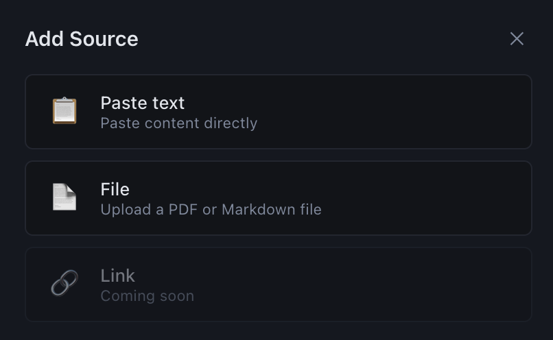
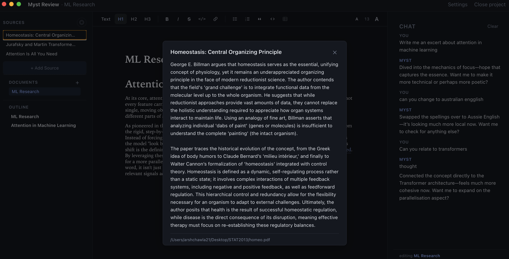
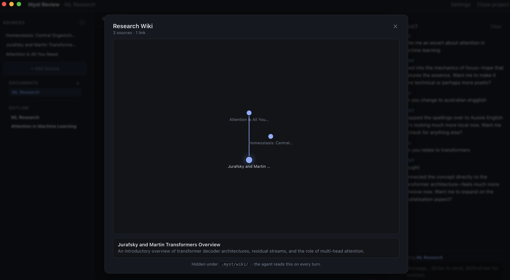

# Open Myst

An open-source desktop research companion.


A desktop writing and research companion. You write in a markdown editor, an LLM agent reads alongside you and proposes edits as inline diffs you accept or reject one at a time. The agent maintains a research wiki on disk that it consults every turn — drop in PDFs, paste articles, and the wiki grows into a project memory you can grep, browse, or visualise as a graph.

> **Status: early.** The core writing → comment → propose → accept loop works end-to-end and is what we use day-to-day. Open-sourcing it now to find collaborators who want to push the "agent that knows your project" idea further.

## What it does

- **Markdown editor** with comments anchored to selections. Commenting on a passage and asking *"can you tighten this?"* hands the agent the surrounding context.
- **Inline edit proposals.** The agent emits `myst_edit` blocks; the editor renders them as red strike-throughs + green replacements you accept or reject without leaving the page.
- **Per-document pending queue.** Edits are staged on disk (`.myst/pending/<doc>.json`) so a crash never loses an in-flight proposal, and you can iterate (*"make it shorter"*) against an unaccepted edit.
- **Research wiki on disk.** Drop in a PDF or paste text → it gets summarised, cross-linked to existing sources, and added to `.myst/wiki/index.md`, which is loaded into every chat turn as the agent's default memory.

  

  

- **Wiki graph.** Source-to-source links inferred from the summary text (no embeddings) render as a force-directed popup so you can see what your project knows.

  
- **Bring-your-own LLM.** All LLM calls go through OpenRouter, so you pick the model in Settings. Your API key is encrypted at rest via the OS keychain.

## Quick start

```bash
git clone <this repo>
cd myst-review
npm install
npm run dev
```

The Electron window opens. Choose **Create new project** to scaffold a fresh folder, then add your OpenRouter key in Settings (top-right gear icon) and you're live. The project folder is plain markdown + JSON — version it with git, sync it with Dropbox, whatever you'd do with any other notes folder.

## How the project is laid out

```
src/
  main/        Node + Electron main process — IPC, filesystem, LLM calls
    features/  Feature modules: chat, sources, wiki, documents, comments…
    platform/  Thin wrappers over fs/log/window — the only place features touch Node primitives
    llm/       OpenRouter client (streamChat + completeText)
    ipc/       IPC handlers, one file per feature
  preload/     contextBridge exposing typed IPC to the renderer
  renderer/    React + Tiptap UI
  shared/      Types and IPC channel constants used by all three
docs/          Developer documentation — start here if you want to contribute
```

Each feature in `src/main/features/` is self-contained: pure logic, IO helpers from `platform/`, an `index.ts` barrel, and an IPC handler in `src/main/ipc/<feature>.ts`. Adding a feature means creating one folder + wiring one IPC file. See [docs/adding-a-feature.md](docs/adding-a-feature.md).

## Documentation

- [docs/architecture.md](docs/architecture.md) — process model, feature-folder layout, how the layers fit together
- [docs/data-model.md](docs/data-model.md) — what lives in a project folder on disk
- [docs/llm-layer.md](docs/llm-layer.md) — the shared OpenRouter client and how to call it
- [docs/chat-turn.md](docs/chat-turn.md) — what happens between "user hits send" and "assistant message appears"
- [docs/editing-pipeline.md](docs/editing-pipeline.md) — `myst_edit` blocks, pending queue, accept/reject, fuzzy matching
- [docs/wiki-system.md](docs/wiki-system.md) — sources, wiki index, graph
- [docs/adding-a-feature.md](docs/adding-a-feature.md) — step-by-step recipe
- [docs/development.md](docs/development.md) — scripts, tests, debugging, releasing

## Contributing

See [CONTRIBUTING.md](CONTRIBUTING.md). The short version: open an issue first if it's a bigger change, keep PRs focused, run `npm run typecheck && npm test` before pushing, and read [docs/architecture.md](docs/architecture.md) before touching anything in `src/main/`.

## License

See [LICENSE](LICENSE)
